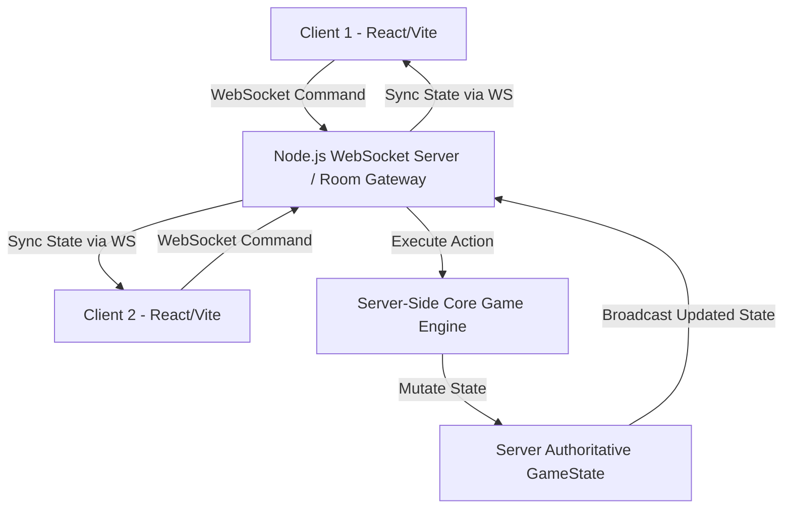

# System Architecture & Technical Design

## 1. Architectural Philosophy — Server-Authoritative Online Multiplayer
Trò chơi áp dụng kiến trúc **Server-Authoritative Decoupled Architecture**:
- **Core Game Engine (`@monopoly/engine`)**: Thuần TypeScript (Pure TS), 0 dependency bên ngoài. Chạy trên Server Node.js (WebSocket Server) để chịu trách nhiệm duy nhất quản lý Game State, thực thi State Machine, xử lý luật chơi và bảo mật chống gian lận.
- **WebSocket Server & Room Gateway (`@monopoly/server`)**: Quản lý các phòng chơi (Room Management), nhận kết nối từ WebSocket Clients, phân giải tin nhắn Command, kiểm tra quyền truy cập của người chơi trong phòng và broadcast GameState mới tới tất cả các player trong phòng.
- **UI Presentation Layer (`@monopoly/web`)**: Web Client (React + Vite). Chỉ đóng vai trò nhận `GameState` từ Server qua WebSocket để render bàn cờ/UI và gửi `PlayerActionCommand` (VD: `CREATE_ROOM`, `JOIN_ROOM`, `ROLL_DICE`, `BUY_PROPERTY`, `TRADE_OFFER`) về Server.

## 2. Core Modules
1. **Room Manager Engine**: Quản lý phòng chơi (Tạo phòng, sinh mã Room Code 6 ký tự, Join phòng, Đổi vị trí, Sảnh chờ Ready, Disconnect/Reconnect timer).
2. **Action Log & History Engine (Event Sourcing)**: Ghi nhận và lưu trữ toàn bộ chuỗi sự kiện/nước đi (`GameEventLog[]`) theo thứ tự thời gian. Phục vụ:
   - Hiển thị bảng **Lịch sử nước đi (In-game Action Feed)** trực quan trên UI.
   - Khôi phục 100% trạng thái ván chơi khi người chơi bị rớt mạng và kết nối lại (Reconnect Sync).
   - Xuất dữ liệu xem lại ván đấu (Replay/Audit log).
3. **Board Engine**: Lưu trữ 40 ô cờ, ánh xạ ô đất, ga, utility, thuế, tù.
4. **Player Engine**: Quản lý thông tin player trong phòng (cash, status: ACTIVE/IN_JAIL/BANKRUPT, properties, getOutOfJailCards, position, socketId).
5. **Turn & Dice Engine**: Xử lý đổ xí ngầu D6 trên server, đếm double (3 lần double -> vào Jail), chuyển lượt.
6. **Tile Resolver**: Nhận diện loại ô khi player landing (Property, Community, Chance, Tax, GoToJail, Go...).
7. **Payment & Rent Engine**: `transferMoney(from, to, amount)`, tính tiền thuê đất/ga/điện nước theo monopoly/nhà.
8. **Building Engine**: Xây nhà/khách sạn tuân thủ quy tắc xây đều, giới hạn 32 nhà / 12 khách sạn.
9. **Mortgage Engine**: Thế chấp (50% giá mua) và Giải chấp (+10% lãi).
10. **Trade Engine**: Quản lý đàm phán thương lượng trước khi lắc xí ngầu (`Offer` -> `Accept`/`Reject`/`Counter-offer`).
11. **Card Engine**: Rút thẻ Chance/Community, giải thi hành action tương ứng từ JSON payload.
12. **Debt & Bankruptcy Engine**: Xử lý thanh lý tài sản khi không đủ tiền trả nợ, gán tài sản cho Creditor hoặc Bank.
13. **Victory Engine**: Kiểm tra điều kiện thắng (Classic: người chơi cuối cùng sống sót; Time/Turn Limit: ai cao tiền tài sản nhất).

## 3. Technology Stack Choice
- **Core Engine & Server**: TypeScript (Strict Mode), Node.js, Socket.io / WebSocket (`ws`).
- **Data Persistence**: In-Memory Event Sourcing Log Buffer + Session File Storage (Lưu trữ toàn bộ danh sách `GameEvent` của từng ván đấu).
- **Frontend**: Vite + React + Vanilla CSS (Custom Design System, Glassmorphism, Micro-animations).
- **Unit Testing**: Vitest (Viết unit test coverage >90% cho Core Engine & Room Logic).
